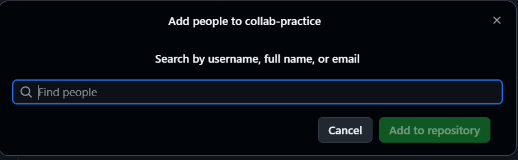
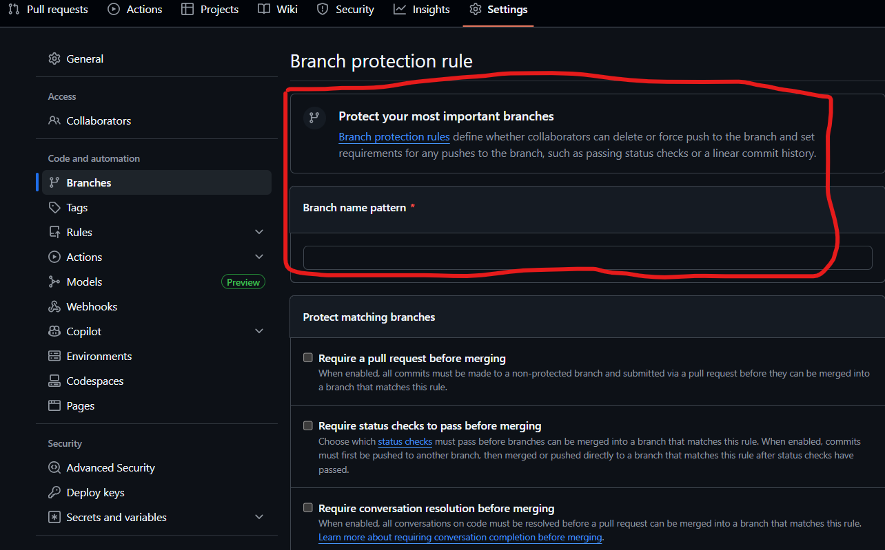

# 👑 Repository Owner Guide

> **Complete step-by-step instructions for the repository owner to set up and manage collaborative GitHub workflows**

> 💡 **Companion Guide:** This guide works alongside the [TEAMMATES_GUIDE.md](TEAMMATES_GUIDE.md) - share that guide with your team members so they know how to contribute effectively.

---

## 📋 Table of Contents

1. [Repository Setup](#1️⃣-repository-setup--initialization)
2. [Collaborator Management](#2️⃣-collaborator-management)
3. [Branch Protection](#3️⃣-branch-protection-setup)
4. [Pull Request Review](#5️⃣-pull-request-review--management)
5. [Final Synchronization](#6️⃣-final-synchronization)
6. [Best Practices](#-best-practices)
7. [Support & Resources](#-support--resources)

---

## 1️⃣ Repository Setup & Initialization

### Step 1: Create Local Repository

```bash
# Create and navigate to project directory
mkdir collab-practice
cd collab-practice

# Initialize Git repository
git init

# Create initial project files
touch index.html style.css script.js
```

### Step 2: Initial Commit & Push

```bash
# Stage all files
git add .

# Create initial commit
git commit -m "Initial project setup with basic HTML, CSS, and JS files"

# Set main branch
git branch -M main

# Add remote origin (replace with your actual repo URL)
git remote add origin https://github.com/faizan-ahmad5/collab-practice.git

# Push to GitHub
git push -u origin main
```

---

## 2️⃣ Collaborator Management

### Step 1: Navigate to Repository Settings

1. Go to your GitHub repository
2. Click **Settings** tab
3. Select **Collaborators** from the left sidebar

### Step 2: Add Team Members

```
👥 Team Members to Add:
├── Developer 1 (GitHub username: @developer1-username)
├── Developer 2 (GitHub username: @developer2-username)
└── Developer 3 (GitHub username: @developer3-username)
```

**Process for each collaborator:**

1. Click **"Add people"**
2. Enter their **GitHub username or email**
3. Select **"Write"** permission level
4. Click **"Add [username] to this repository"**
5. They'll receive an **email invitation**

📸 **Visual Guide: Adding Collaborators**  
  
_This image shows the GitHub interface for adding collaborators to your repository._

### Step 3: Verify Collaborator Access

- ✅ Check that all invitations are **accepted**
- ✅ Confirm collaborators appear in the **Collaborators list**
- ✅ Test that they can **view the repository**

> 📝 **Share with Team:** Once collaborators are added, share the [TEAMMATES_GUIDE.md](TEAMMATES_GUIDE.md) with your team members so they know how to contribute to the project.

---

## 3️⃣ Branch Protection Setup

### Step 1: Access Branch Protection Rules

1. Go to **Settings** → **Branches**
2. Click **"Add rule"** or **"Add branch protection rule"**
3. Enter `main` as the **branch name pattern**

📸 **Visual Guide: Branch Protection Setup**  
  
_This image shows the GitHub interface for setting up branch protection rules._

### Step 2: Configure Protection Settings

Enable the following protections:

#### 🛡️ **Required Settings:**

- ✅ **Require a pull request before merging**
  - ✅ Require approvals: **1** (minimum)
  - ✅ Dismiss stale PR approvals when new commits are pushed

### Step 3: Save Protection Rules

Click **"Create"** to activate branch protection.

---

## 5️⃣ Pull Request Review & Management

> 📝 **For Team Members:** Make sure your team follows the PR process outlined in [TEAMMATES_GUIDE.md](TEAMMATES_GUIDE.md) for consistent submissions.

### Step 1: Monitor Incoming Pull Requests

- 📧 **Enable notifications** for PR creation
- 🔔 Check the **Pull Requests** tab regularly
- 📱 Use **GitHub Mobile** app for quick notifications

### Step 2: Pull Request Review Process

#### **For Each PR, Follow This Checklist:**

##### 📝 **Initial Review:**

- [ ] **Read the PR description** thoroughly
- [ ] **Check the branch name** matches assignment
- [ ] **Verify files changed** are appropriate
- [ ] **Ensure no conflicts** with main branch

##### 🔍 **Code Review:**

- [ ] **Navigate to "Files changed" tab**
- [ ] **Review line-by-line changes**
- [ ] **Check code quality and formatting**
- [ ] **Verify functionality makes sense**
- [ ] **Look for potential issues or improvements**

##### 💬 **Provide Feedback:**

```markdown
# Review Comment Templates:

## ✅ Approval:

"Great work! The [feature] implementation looks solid. Merging now."

## 🔄 Requesting Changes:

"Thanks for the PR! I have a few suggestions:

- [Specific feedback 1]
- [Specific feedback 2]
  Please address these and I'll re-review."

## 💡 Minor Suggestions:

"Nice implementation! Consider:

- [Optional improvement 1]
- [Optional improvement 2]
  Approving as-is, but feel free to implement if you'd like."
```

##### ✅ **Approval & Merge:**

1. Click **"Review changes"**
2. Select **"Approve"**
3. Add encouraging comment
4. Click **"Submit review"**
5. Click **"Merge pull request"**
6. Choose merge strategy: **"Create a merge commit"**
7. Click **"Confirm merge"**
8. **Delete the feature branch** (cleanup)

### Step 3: Post-Merge Actions

```bash
# Update your local main branch
git checkout main
git pull origin main

# Verify all changes are integrated
git log --oneline -5
```

---

## 6️⃣ Final Synchronization

### Step 1: Notify Team of Completion

Once all PRs are merged, send this message:

````markdown
## 🎉 All Pull Requests Merged Successfully!

Great job everyone! All feature branches have been successfully merged into main.

### 📥 **IMPORTANT - Update Your Local Repository:**

Please run these commands to sync your local repository:

```bash
# Switch to main branch
git checkout main

# Pull latest changes
git pull origin main

# Clean up old local branches (optional)
git branch -d feature/[your-branch-name]
```
````

### 🔍 **Verify Integration:**

- Check that all your changes appear in the main branch
- Test the complete application locally
- Ensure no conflicts or issues

### 🚀 **Next Steps:**

- Review the final integrated codebase
- Test the complete application
- Celebrate successful collaboration! 🎊

### 📝 **Learning Recap:**

You've successfully practiced:

- ✅ Feature branch workflow
- ✅ Pull Request creation
- ✅ Code review process
- ✅ Collaborative development

````

### Step 2: Final Repository Verification
```bash
# Clone fresh copy to verify everything works
git clone https://github.com/[your-username]/collab-practice.git verification-test
cd verification-test

# Open index.html in browser to test
# Verify all features are working
````

---

## 💡 Best Practices

### 🎯 **Repository Management:**

- ✅ **Regular backup** of important branches
- ✅ **Clear commit messages** using conventional format
- ✅ **Consistent naming** for branches and PRs
- ✅ **Prompt response** to team questions
- ✅ **Document decisions** in Issues or Wiki

### 🔍 **Code Review Standards:**

- ✅ **Constructive feedback** - focus on code, not person
- ✅ **Specific suggestions** - provide actionable comments
- ✅ **Timely reviews** - respond within 24 hours
- ✅ **Acknowledge good work** - celebrate team success
- ✅ **Consistent standards** - apply same criteria to all

### 🤝 **Team Communication:**

- ✅ **Clear expectations** - set deadlines and requirements
- ✅ **Regular check-ins** - monitor progress
- ✅ **Open door policy** - encourage questions
- ✅ **Celebrate milestones** - recognize achievements
- ✅ **Learning focus** - emphasize growth over perfection

### 📊 **Success Metrics:**

- ✅ All team members successfully create PRs
- ✅ No direct pushes to main branch
- ✅ All PRs reviewed and merged cleanly
- ✅ Team understands the collaborative workflow
- ✅ Final product integrates all contributions

---

## 📞 Support & Resources

### 🔗 **Helpful Links:**

- [GitHub Flow Guide](https://guides.github.com/introduction/flow/)
- [Pull Request Best Practices](https://github.blog/2015-01-21-how-to-write-the-perfect-pull-request/)
- [Git Branching Tutorial](https://learngitbranching.js.org/)
- [Markdown Guide](https://www.markdownguide.org/)

### � **Need Help?**

If you encounter any issues:

1. **Check this guide first**
2. **Review the [TEAMMATES_GUIDE.md](TEAMMATES_GUIDE.md)** for team member processes
3. **Search GitHub documentation**
4. **Ask in team communication channel**
5. **Create an Issue** in this repository
6. **Contact repository owner** directly

---

_Last updated: October 2025 | Repository: collab-practice | Owner: @faizan-ahmad5_
