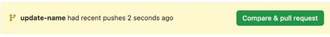
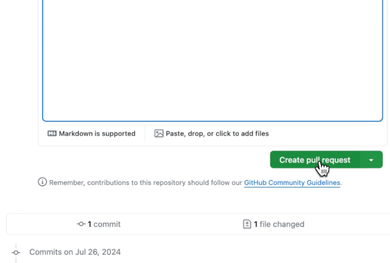

# 👥 Teammates Collaboration Guide

> **Complete step-by-step instructions for team members to contribute to the GitHub collaboration project**#### � Pull Request Process

1. [Team Overview](#-team-overview)
2. [Getting Started](#-getting-started)
3. [Branch Assignment](#-branch-assignment)
4. [Development Workflow](#-development-workflow)
5. [Pull Request Process](#-pull-request-process)
6. [Individual Task Details](#-individual-task-details)
7. [Final Synchronization](#-final-synchronization)
8. [Tips & Best Practices](#-tips--best-practices)

---

## 👨‍💻 Team Overview

### 📊 **Team Structure:**

| 👤 **Member**        | 🎯 **Role**                 | 🌿 **Branch**            | 📁 **Primary File**        |
| -------------------- | --------------------------- | ------------------------ | -------------------------- |
| **Repository Owner** | Repository Owner & Reviewer | `main`                   | All files (review & merge) |
| **Developer 1**      | Frontend Developer          | `feature/navbar`         | `index.html`               |
| **Developer 2**      | UI/UX Designer              | `feature/styling`        | `style.css`                |
| **Developer 3**      | JavaScript Developer        | `feature/js-interaction` | `script.js`                |

### 🎯 **Project Goal:**

Learn GitHub collaboration by building a simple website where each team member contributes a specific feature through separate branches and Pull Requests.

---

## 🚀 Getting Started

### Step 1: Clone the Repository

```bash
# Clone the repository to your local machine
git clone https://github.com/[repository-owner]/collab-practice.git

# Navigate to the project directory
cd collab-practice

# Verify you're on the main branch
git branch
```

### Step 2: Verify Repository Setup

```bash
# Check current status
git status

# View existing files
ls
# You should see: index.html, style.css, script.js, README.md, OWNER_GUIDE.md, TEAMMATES_GUIDE.md

# Check remote connection
git remote -v
```

---

## 🌿 Branch Assignment

### **Individual Branch Assignments:**

#### 🔶 **Developer 1 - Navigation Feature**

- **Branch Name:** `feature/navbar`
- **Primary File:** `index.html`
- **Task:** Create and enhance navigation structure

#### 🔷 **Developer 2 - Styling Feature**

- **Branch Name:** `feature/styling`
- **Primary File:** `style.css`
- **Task:** Design visual layout and responsiveness

#### 🔸 **Developer 3 - JavaScript Feature**

- **Branch Name:** `feature/js-interaction`
- **Primary File:** `script.js`
- **Task:** Add interactive functionality

---

## 🔄 Development Workflow

### Step 1: Create Your Feature Branch

```bash
# Create and switch to your assigned branch
# For Developer 1:
git checkout -b feature/navbar

# For Developer 2:
git checkout -b feature/styling

# For Developer 3:
git checkout -b feature/js-interaction

# Verify you're on the correct branch
git branch
# The current branch will have an asterisk (*)
```

### Step 2: Make Your Changes

- Open your assigned file in your preferred code editor
- Implement the features according to your task details (see section below)
- Save your changes frequently
- Test your changes by opening `index.html` in a browser

### Step 3: Stage and Commit Changes

```bash
# Check what files have been modified
git status

# Add your changes to staging
git add [your-filename]
# Example: git add index.html

# Commit with a descriptive message
git commit -m "Add [feature description]"
# Example: git commit -m "Add navigation bar with home, about, contact links"
```

### Step 4: Push Your Branch

```bash
# Push your branch to GitHub
git push origin [your-branch-name]
# Example: git push origin feature/navbar

# If this is your first push, you might see a message about setting upstream
# Follow the suggested command if prompted
```

---

## �️ Steps to Create a Pull Request on GitHub

> 🎥 **Need Help?** If you're confused about creating Pull Requests, watch this video tutorial: [Creating a Simple Github Pull Request](https://youtu.be/rgbCcBNZcdQ?t=201) (Start from 3:21)

### 1. **Push Your Changes to a Branch**

After committing your changes locally, push them to a new or existing branch on GitHub. Once pushed, GitHub will show a notification banner like this:

T� **Branch Push Notification**  
  
This banner appears at the top of the repository page, indicating that your branch (e.g., `update-name`) has recent changes.  
It includes a green **"Compare & pull request"** button.\*Branch Push Notification\*\*

---

### 2. **Click "Compare & pull request"**

Click the green button shown in the banner to begin the pull request process. This will take you to the PR creation page.

---

### 3. **Fill Out the Pull Request Form**

On the PR creation page:

- Add a **title** that summarizes your changes.
- Write a **description** explaining what the changes do and why they're needed.
- Optionally, attach files or images to support your explanation.

**Create Pull Request Interface**  
  
This image shows the PR form with the green **"Create pull request"** button at the bottom.  
You'll also see a reminder to follow GitHub's Community Guidelines and a summary of commits and file changes.

---

### 4. **Click "Create pull request"**

Once everything looks good, click the green button to submit your PR. Your changes are now ready for review by collaborators or maintainers.

---

### 5. **Review, Discuss, and Merge**

After submission:

- Collaborators can comment, suggest changes, or approve the PR.
- Once approved, the PR can be merged into the main branch.

---

## 🎯 Individual Task Details

### 🔶 **Developer 1 - Navigation Feature**

#### **Objective:**

Create a navigation menu that allows users to navigate the website.

#### **Code to Add to `index.html`:**

```html
<!-- Add this navigation section after the <body> tag and before the <h1> -->
<nav>
  <ul>
    <li><a href="#home">Home</a></li>
    <li><a href="#about">About</a></li>
    <li><a href="#services">Services</a></li>
    <li><a href="#contact">Contact</a></li>
  </ul>
</nav>
```

#### **Commands:**

```bash
git add index.html
git commit -m "Add navigation bar with main menu items"
git push origin feature/navbar
```

#### **Pull Request Details:**

- **Title:** `Feature: Add navigation bar with main menu`
- **Description:** Added navigation menu with Home, About, Services, and Contact links

---

### 🔷 **Developer 2 - Styling Feature**

#### **Objective:**

Style the website to make it visually appealing and responsive.

#### **Code to Add to `style.css`:**

```css
/* Reset and base styles */
* {
  margin: 0;
  padding: 0;
  box-sizing: border-box;
}

body {
  font-family: "Arial", sans-serif;
  line-height: 1.6;
  color: #333;
  background: linear-gradient(135deg, #667eea 0%, #764ba2 100%);
  min-height: 100vh;
}

/* Navigation styles */
nav {
  background-color: rgba(255, 255, 255, 0.95);
  padding: 1rem 0;
  box-shadow: 0 2px 10px rgba(0, 0, 0, 0.1);
  position: sticky;
  top: 0;
  z-index: 100;
}

nav ul {
  list-style: none;
  display: flex;
  gap: 2rem;
  justify-content: center;
  margin: 0;
  padding: 0;
}

nav a {
  text-decoration: none;
  color: #333;
  font-weight: 500;
  transition: color 0.3s ease;
}

nav a:hover {
  color: #667eea;
}

/* Main content styles */
h1 {
  color: white;
  font-size: 3rem;
  margin-bottom: 1rem;
  text-shadow: 2px 2px 4px rgba(0, 0, 0, 0.3);
  text-align: center;
  padding: 2rem;
}

/* Responsive design */
@media (max-width: 768px) {
  nav ul {
    flex-direction: column;
    gap: 1rem;
  }

  h1 {
    font-size: 2rem;
  }
}
```

#### **Commands:**

```bash
git add style.css
git commit -m "Add comprehensive styling with responsive design"
git push origin feature/styling
```

#### **Pull Request Details:**

- **Title:** `Feature: Add responsive styling and modern design`
- **Description:** Added modern styling with gradient background, navigation styling, and responsive design

---

### 🔸 **Developer 3 - JavaScript Feature**

#### **Objective:**

Add interactive functionality to enhance user experience.

#### **Code to Add to `script.js`:**

```javascript
// Wait for DOM to be fully loaded
document.addEventListener("DOMContentLoaded", function () {
  console.log("🚀 GitHub Collaboration Practice - JavaScript Loaded!");

  // Initialize interactive features
  initializeClickHandlers();
  initializeNavigation();
});

// Function to handle click interactions
function initializeClickHandlers() {
  const heading = document.querySelector("h1");

  if (heading) {
    heading.addEventListener("click", function () {
      // Change text content on click
      if (this.textContent.includes("Welcome")) {
        this.textContent = "🎉 Great job on the collaboration! 🎉";
        this.style.color = "#FFD700";
      } else {
        this.textContent = "Welcome to Our Collaboration Project 🚀";
        this.style.color = "white";
      }
    });

    // Add hover effect
    heading.addEventListener("mouseenter", function () {
      this.style.transform = "scale(1.05)";
      this.style.transition = "transform 0.3s ease";
    });

    heading.addEventListener("mouseleave", function () {
      this.style.transform = "scale(1)";
    });
  }
}

// Function to handle navigation interactions
function initializeNavigation() {
  const navLinks = document.querySelectorAll("nav a");

  navLinks.forEach((link) => {
    link.addEventListener("click", function (e) {
      e.preventDefault();

      const target = this.getAttribute("href").substring(1);
      console.log(`Navigation clicked: ${target}`);

      // Simple alert for demonstration
      alert(
        `You clicked on ${
          target.charAt(0).toUpperCase() + target.slice(1)
        } section!`
      );

      // Add active state
      navLinks.forEach((l) => l.classList.remove("active"));
      this.classList.add("active");
    });
  });
}

// Welcome message
console.log(`
🎉 Welcome to our GitHub Collaboration Practice!

Team Members:
👑 Repository Owner - Repository Owner
🔶 Developer 1 - Navigation Developer  
🔷 Developer 2 - UI/UX Designer
🔸 Developer 3 - JavaScript Developer

Each member contributed through separate branches and Pull Requests!
`);
```

#### **Commands:**

```bash
git add script.js
git commit -m "Add interactive JavaScript functionality and animations"
git push origin feature/js-interaction
```

#### **Pull Request Details:**

- **Title:** `Feature: Add interactive JavaScript functionality`
- **Description:** Added click handlers, navigation interactions, entrance animations, and console logging

---

## 🔄 Final Synchronization

### After All PRs Are Merged

Once the repository owner has reviewed and merged all Pull Requests:

#### **Update Your Local Repository:**

```bash
# Switch back to main branch
git checkout main

# Pull the latest changes from remote
git pull origin main

# Verify all changes are integrated
git log --oneline -5

#### **Test the Complete Application:**

1. **Open `index.html`** in your web browser
2. **Verify all features work together:**
   - Navigation is visible and styled
   - Styling looks good
   - JavaScript interactions work
3. **Check browser console** for any errors
4. **Test responsive design** by resizing browser window

```

## 💡 Tips & Best Practices

### 🔧 **Development Tips:**

- ✅ **Test frequently** - Open `index.html` in browser after each change
- ✅ **Small commits** - Make frequent, small commits with clear messages
- ✅ **Follow naming conventions** - Use descriptive branch and commit names
- ✅ **Stay focused** - Only modify your assigned files
- ✅ **Ask questions** - Don't hesitate to ask if you're unsure

### 📝 **Git Best Practices:**

- ✅ **Commit message format:** `Add [what you added]` or `Fix [what you fixed]`
- ✅ **Pull before push** - Always pull latest changes before pushing
- ✅ **One feature per branch** - Keep branches focused on single features
- ✅ **Descriptive PR titles** - Make it clear what your PR accomplishes
- ✅ **Clean code** - Ensure your code is readable and well-formatted

### 🤝 **Collaboration Tips:**

- ✅ **Communicate early** - Let others know if you encounter issues
- ✅ **Respect others' work** - Don't modify files assigned to teammates
- ✅ **Be patient** - Wait for proper review before expecting merges
- ✅ **Learn from reviews** - Use feedback to improve your skills
- ✅ **Celebrate success** - Acknowledge team achievements

### ⚠️ **Common Pitfalls to Avoid:**

- ❌ **Don't work directly on main branch**
- ❌ **Don't force push** (`git push -f`) unless absolutely necessary
- ❌ **Don't ignore merge conflicts** - Ask for help if you encounter them
- ❌ **Don't rush** - Take time to test your changes
- ❌ **Don't modify other people's files** without coordination

---

## 🆘 Need Help?

### 🔍 **Troubleshooting Resources:**

- **Git Issues:** [Git Documentation](https://git-scm.com/docs)
- **GitHub Help:** [GitHub Docs](https://docs.github.com)
- **HTML/CSS/JS:** [MDN Web Docs](https://developer.mozilla.org)

### 📞 **Getting Support:**

1. **Check this guide first** for common solutions
2. **Search online** for specific error messages
3. **Ask team members** in your communication channel
4. **Contact repository owner** for guidance
5. **Create an issue** in the repository if needed

---

## 🎉 Congratulations!

By completing this collaboration exercise, you've learned:

- ✅ **Git branching workflow** - Creating and managing feature branches
- ✅ **Pull Request process** - Submitting code for review
- ✅ **Code review culture** - Understanding collaborative development
- ✅ **Team coordination** - Working with multiple developers
- ✅ **GitHub features** - Using professional development tools

**These skills are essential for real-world software development!**

---

_Last updated: October 2025 | Repository: collab-practice | Team Guide v2.0_
```
